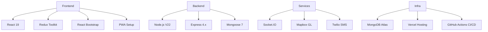

```mermaid
graph TD
    A[Frontend] --> B[React 19]
    A --> C[Redux Toolkit]
    A --> D[React Bootstrap]
    A --> E[PWA Setup]

    F[Backend] --> G[Node.js V22]
    F --> H[Express 4.x]
    F --> I[Mongoose 7]

    J[Services] --> K[Socket.IO]
    J --> L[Mapbox GL]
    J --> M[Twilio SMS]

    N[Infra] --> O[MongoDB Atlas]
    N --> P[Vercel Hosting]
    N --> Q[GitHub Actions CI/CD]
```
