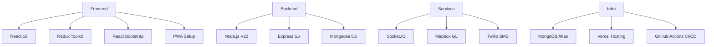

---

# Tech Stack Overview

| Layer    | Technology      | Why Chosen?                            |
| -------- | --------------- | -------------------------------------- |
| Frontend | React 19        | Modern, component-based UI             |
|          | Redux Toolkit   | Predictable state management           |
|          | React Bootstrap | Fast, responsive UI components         |
|          | PWA Setup       | Offline-first, installable web app     |
| Backend  | Node.js 18      | Fast, scalable JS runtime              |
|          | Express 5.x     | Minimal, flexible web framework        |
|          | Mongoose 8.x    | ODM for MongoDB, schema validation     |
| Services | Socket.IO       | Real-time updates (seat map, bookings) |
|          | Mapbox GL       | Custom, performant maps                |
|          | Twilio SMS      | SMS fallback for notifications         |
| Infra    | MongoDB Atlas   | Managed, scalable NoSQL DB             |
|          | Vercel Hosting  | Fast, serverless deployment            |
|          | GitHub Actions  | CI/CD, automated testing & deploy      |

---

## Key Dependencies

-   **bcryptjs**: Password hashing (security)
-   **jsonwebtoken**: JWT authentication
-   **express-validator**: Input validation
-   **dotenv**: Environment variable management
-   **Jest**: Unit testing (recommended)
-   **ESLint/Prettier**: Code quality & formatting

---

## Dev & Deployment Notes

-   **Dev**: Use `npm run dev` for hot-reload (see package.json)
-   **Testing**: Run `npm test` for backend tests
-   **CI/CD**: GitHub Actions runs tests on PRs, Vercel auto-deploys from `main`
-   **Env**: Store secrets in `.env` (never commit to git)

---

## Keep Diagram Updated

-   Update the mermaid diagram and this file if you add/remove major tech.
